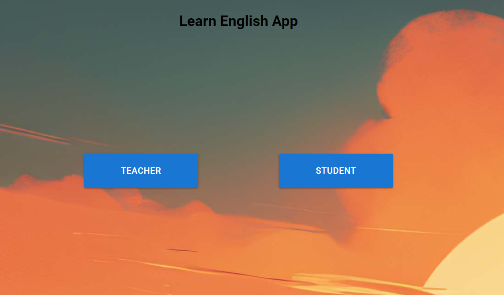

# learn-english-app



App made for translating English words to Finnish or vice versa. App supports two users (Teacher and student).
Teacher can add word pairs to the system and student then can try to translate them with a quiz like form.

## Moticvation

This app was created as a part of my backend development course in TAMK. 
This is the end project of the course.

## Tech and Framework

**Programming Languages**
- JavaScript (Node.js)

**Frameworks and Libraries**
- React.js (Frontend)
- Express.js (Backend)

**Database**
- MySQL

**Tools**
- Git and GitHub
- Render.com

## Installation

Follow these steps to get the app running locally.

After cloning the repository to your platform:

1. cd "your-project-repo"
2. In the root of the project run command
    - **npm install**
3. cd frontend and run command
    - **npm install**
4. after that you can run these commands in the root of the project to start the app
    - **npm run dev:backend** and **npm run dev:frontend**

>[!NOTE]
>The app uses environment variables for connecting to the database.
>You need to add your own .env file into the root of the project and
>connect to your own database.

>This is the query to create same structure for the database that is used 
>for this app:
```
CREATE TABLE words (
  id INT(11) NOT NULL AUTO_INCREMENT,
  english_word VARCHAR(255) NOT NULL,
  finnish_word VARCHAR(255) NOT NULL,
  learning_direction VARCHAR(3) NOT NULL,
  PRIMARY KEY (id)
);
```
## Bugs

No known bugs at the moment

## Screencast

https://www.youtube.com/watch?v=3IdDkCJxpR4

## Other

The app is also currently running in the cloud:

https://learn-english-usq9.onrender.com/

## License 

MIT (c) Aleksi Väätäinen